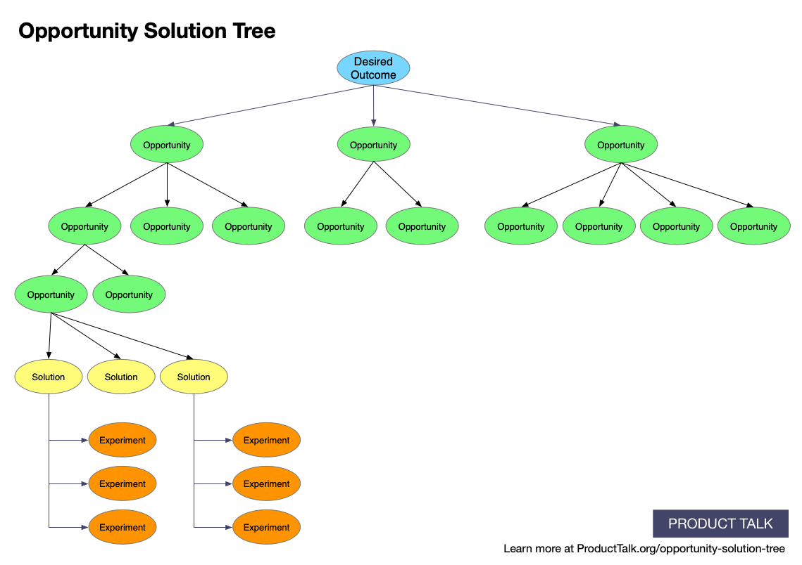

# Why This Opportunity Solution Tree is Changing the Way Product Teams Work

<https://www.producttalk.org/2016/08/opportunity-solution-tree/>

## Key takeaways

## Notes

* Teams struggle to see the bigger picture when working in isolation. It is uncearl how the work to be done impacts larger business outcomes.
* "I kept asking myself, how do I decide what comes next? And more importantly, how do I teach this to teams?"
* Teams frequently know how to discover work (e.g. customer interviews, failing metrics, etc.) or deliver work (e.g. code feature) but not meaningfully cycle/switch between both.
  * Blue work versus Red work from Leadership is Language.
  * Reframe as "discovering opportunities and discovering solutions"
* "Better mental representations are what set experts apart from novices."
  * A mental representation is cognative object orientated programming. Thing X has states A, B, C and is linked to Thing Y through Connection Z.
* Better mental representations let people response more quickly and effectively to change.
* When thinking of a solution, ask what problem it is solving for. Then try to find additional possible solutions to that problem.
  * [Buy a house] -> (Feel grounded in the community) -> [Buy a house], [join a club], [volunteer]
* Problems only have better or worse solutions, but you can only understand better or worse if you understand the context the decisoin is being made in.
  * Context acts as guard rails to ensure that solutions solve the root problem and inform trade offs.
* "4 common gaps in our thinking today"
  * "We don't examine our ideas before investing in them"
  * "We don’t consider enough ideas."
    * Before digging or committing to an idea, try to frame, reframe, or think of alternative solutions that may also fix the root issue.
  * "We don’t multitrack in a systematic way."
    * Link ideas to opportunities which then link to desired outcomes. Force rank opportunities and then force rank solutions on the first opportunity. That is the solution you should start exploring first.
  * "Our solutions don’t connect to an opportunity or our desired outcome at all."
    * Create a visual graph of how solutions link to opportunities link to outcomes.
* Opportunity solution tree
  * Make implicit assumptions explicit by graphing it out
  * Steps:
    1. Clear desired outcomes
        * Existing OKRs or metrics may be a good starting point
        * Create seperate trees for each unique desired outcome and force rank them to indicate priority. This pritoization must be clear and concrete. Otherwise, you will never know what the most important branch is and therefore will not know what to cut when solutions for two outcomes conflit with one another.
        * sdfdsf
    1. Opportunities should emerge from customer feedback
        * Generative research: ["Generative research is a qualitative research method designed to help uncover users' problems and find viable solutions"](https://blog.hubspot.com/service/generative-research)
        * This ensures that solutions you propose are (hopefully) actually solving customer problems.
    1. Solutions should be able to come from anywhere: business stakeholders, customers, engineer, designers, front-line support, etc., but they need to support an opportunity.
        * If a solution does not contribute to an opportunity it should be considered a distraction. I would extend this to any solutions / opportunities that are lower than the current opportunity being worked on. Though, be sure to not implement a solution that would detract from a higher priority opportunity / solution / outcome.
    1. Every solution is an experiment/bet which needs to be validated
        * Use experiments linked to solutions to verify these assumptions.
* Multitracking is doing parellel experiments to see what does and does not work. This can mean running multiple experiments, multiple solutions, or multiple opportunities to see how it influences the higher order metric.
* A balanced tree is important to learning what works and what does not work. If a tree is to narrow, it means you are putting all your eggs in one basket. If the tree is too broad, then you are speading yourself too thin.
* Avoid decision making until the last responsible moment, which means trying out many things in parellel.
* Discovery must lead to delivery to build a successful organization.
* Framework for continous product discovery
  * This is a non-linear process. As you learn, update your tree.
  * Every week do discovery and delivery work.
* Insights from the comment section
  * Opportunities and outcomes must also be framed by problem statements. For example, "Feel grounded in the community" means something different for an immigrant verus a recently released convict.
  * Use the 5 Whys Technique to try and get at root issues
  * Opportunities can be throught of as customers problems, pain points, or needs.
  * When doing discovery work, verb focused statements like "feel grounded in the community" are opportunities whereas nouns are solutions like "a house".
