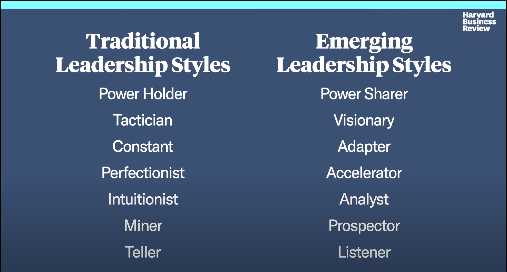

# 7 Key Tensions Every Leader Must Balance

<https://www.youtube.com/watch?v=pGSxI_2RnTY>

## Key Takeaways

## Notes

* Emerging leadership styles
  * Power sharer
  * Visionary
  * Adapter
  * Accelerator
  * Analyst
  * Prospector
  * Listener

* Traditional leadership styles
  * Power holder
  * Tactician
  * Constant
  * Perfectionist
  * Intuitionist
  * Miner
  * Teller

* Tension comes from the traditional and emerging leadership styles for most emerging leaders

* Power holder <-> Power sharer is balance between authority and delegation so they personally can focus on the most important thing (e.g. project power)
* Tactician is more sort term focused <-> Visionary is more big picture and inspiring
* Constant has a very clear north start and very clear and stable messaging <-> Adapter embraces that change is constant
* Perfectionist is detailed oriented <-> Accelerator is somebody who sacrifices quality for speed
* Intuitionist is somebody who makes decisions from the gut <-> Analyst is more data informed
* Miner is somebody who goes deep into a subject, technology, etc. <-> Prospector is somebody who goes more broad and opportunity focused
* Teller gives direction because they are probably an expert <-> Listener are learners

* Emotional intelligence (EI, EQ) is critical balancing these styles for different situations. One meeting may require more Power holder where another requires more of a Power sharer.
* People should pick 3 to 4 and learn how to balance those the best versus trying to balance all at the same time

* Every style has pros and cons. Being a teller may make people feel disengaged.
* After a leadership opportunity / situtation, feel out how people respond and change behavior. If nothing changes, you probably need to adjust your leadership style so that messaging makes outcomes better.

* Fear is a primary factor for why people struggle with adapting in certain leadership styles.
  * Perfectionist may be fearful of delegation because it may turn out wrong
  * Power sharers may be fearful of being seen as authoritarian
  * Tacticians may be fearful of being visionary because it is too fluffy or they are not a good story teller
* Explore where these fears come from may remove these fears
