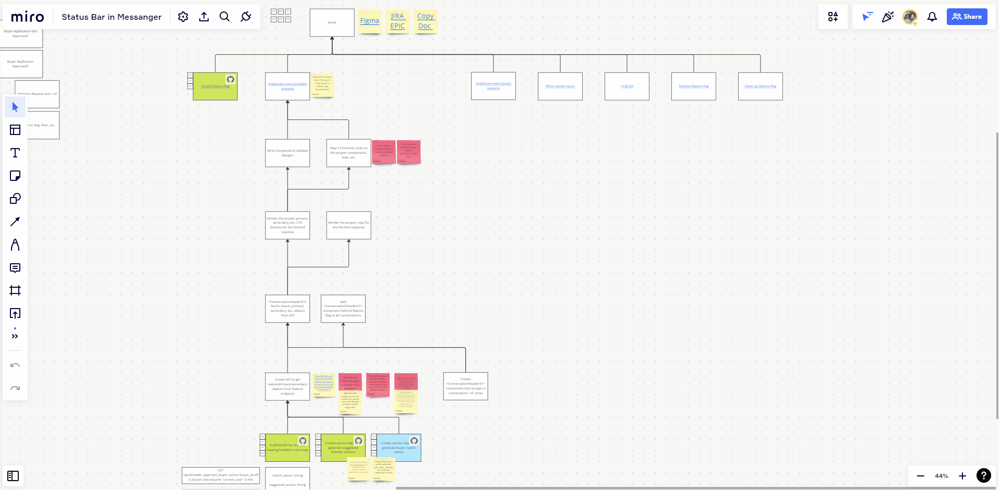

# Steve Kuo - Discovery Trees, can they work for you?

<https://www.youtube.com/watch?v=BvRF8Nv_wmA>

## Key Takeaways

* Discovery Trees (DTs) jump start conversations about scope, capacity, and capability by making the work visible. Other tools add friction to change. DTs on the other hand make change easy so that a DT reflects a teams current understanding of the work to be done.

* A rule of thumb of DTs is to break work down into tiny managable chunks. What "tiny" and "managable" mean is unique to each team. For coding tasks, a rule of thumb I use at Good Dog is to break work into 100 line diffs in GitHub.

* DTs communicate state through color. At Good Dog for example, we use:
  * White - To do
  * Blue - In progress
  * Teal - In code review
  * Green - Done
  * Grey - Skipping

* Monte Carlo simulations can be paired with DTs to calculate velocity and forecasts metrics. These metrics can spark conversations around scope creep or cutting scope.

## Notes

* "DTs are very dynamic"
* DTs embrace discovery (i.e. learning) and change
* Just in time planning - the minimum amount of planning to get something done
* Business traditionally really likes estimates / certainty
* Plans are useless, planning is indispensable - paragraphing Eisenhower
* Problems: how we track, visualize, and estimate work?
  * People are remote
  * Physical boards make it difficult to reference / link directly to external sources
  * Communicate knowns and unknowns
  * Padding in estimates to account for unknown-unknowns
* History
  * Emerged from FAST Agile - <https://www.fastagile.io/>
  * Quinn Gil article on feature trees - <https://quinngil.com/2020/02/03/feature-mapping/>
* "Agile has given us tools to get really good at software delivery. We now need better dynamic ways to get good at discovery." - Ron Q.
* "[DTs are] the simplest/easiest way that I have yet discovered to visualize work (and give estimates) without doing all Agile Planning Theater." - Steve K.
  * How much customer value is there in estimations? - Steve K.
* DTs are a collection of cards that visually communicate work and its state (to do, in progress, done, blocked, etc.)
* Card colors
  * Blue - theme of this frame
  * Yellow - to do
  * Pink - in progress
  * Oranage - blocked
  * Green - done
  * Black - parking lot item
* Online DTs can house other information outside of just the work to be done
  * References / links
  * Reminders
  * Notes
* Start working only when you have enough information to start working.
* As you progress through the tree, update the tree to facilitate communication
* Blocked communicates to stakeholders about external factors they need to help with - easy to see on the board
* "Embrace the chaos of knowing what you know now and not knowing what we don't know" - Steve K.
* Don't task out lower priority / future tasks - don't spent time on something you don't know if you will even do
* "Maximize the amount of planning NOT done" - Steve K.
  * It is clear when something is "done". What most people want is getting something in front of the customer and when that date will be.
* Limit work in progress (WIP)
* Get things in front of customers to start getting feedback
* Emergent design / evolutionary architecture - responding to real (code) signals to deliver
* Always append to DTs - never rewrite old stuff.
* Reference for Monte Carlo estimations: <https://www.focusedobjective.com/pages/free-spreadsheets-and-tools>
* If estimates are too high, cut scope - focus on feature slicing. Monte Carlo forecasts help inform and visualize this conversations with confidence intervals.
* Update estimates on a weekly basis to inform scope cutting
* DTs help communicate where the trouble spots are
* Ask every week: "Can we put this in front of a customer?" - Steve K.
* DTs are not
  * Total chaos
  * Anti-planning
  * Anti-architecture
  * Anti-estimates
* Entry experiments to introduce them to teamsa
  * Bug fixes
  * Refactoring code
  * Technical debt
  * Small new features
* DTs are all about visiblity that everybody (engineers, product owners, etc.) can look at
* Limit WIP, Discipline - only focus on the most important stuff at a given time
* Can help with data based forecasting

* DTs versus Opportunity Solution Trees (OSTs)
  * Many emergeing solutions are finding visual trees helpful for organizing people and communicating work and how it relates to the bigger picture.
  * DTS organize people around outputs; OST organize people around outcomes to inform what they should output.
  * Helps bring down walls between traditionally siloed groups. Get engineers insight into how work impacts outcomes.
  * DTs encourage feature slicing
* Weekly status report are useful for people that are not involved day-to-day in the Discovery Tree.
  * They seem like office hours for stakeholders or other teams that are removed (e.g. external) from the team doing the work.
* Monte Carlo simulations
  * Use "done" cards to inform how much work was completed each week to then inform how much work is forcaste to get done next week. Use historical week-by-week examples to output an average team velocity.
  * Constraints are important to help focus teams (e.g. WIP limites). Timeboxes are another example and Monte Carlo simulations help teams communication when the given timebox might not be right so that scope can be cut instead of teams crunching to meet the timebox - encouraging feature slicing.
  * Have regular conversations about scope, complexity, etc. - growing forecasts act as a trigger to re-evaluate scope
* How do you manage parellized work? Mintain multiple DTs for each isolated stream of work.
* Keep DTs simple so that communication remain adaptable - MIRO is good enough, feel no need for a DT specific tool akin to JIRA.
  * Creating new tasks is a friction point in other tools that discourages people from wanting to make tasks. DTs in MIRO make it simple so that the friction isn't an inhibitor.
* Break large tasks into more smaller and managable chunks. What "smaller" and "managable" means is unique to each team.
  * I personally find 100 lines diff a good rule of thumb that covers scope of refactors, cleaning up code, adding tiny incremental feature slices, etc.
* Make DTs very visible and use color to communicate state. This way, anybody can look at a DT and see what is going on and where the team is currently at.
* DTs act as a living document to communicate what was or was not done. Then, teams can pick back up from where they left off in the future if they need to.
  * This allows teams to pivot without having to lose every bit of context and without having to manage complex documentation.
* DTs make work more visible. This includes the amount of work in progress.
* Terms being used
  * Leafs - tasks
  * Branches - arrows between tasks denoting dependencies / blockers (e.g. task B blocks tasks A)
  * Tree - collection of leafs connected by branches
* Use nametags to communicate who is working on what
  * At GoodDog we leave namestags on "done" tasks so that we know who worked on what incase we need to revisit and gain more context.
* Take snapshots to document history of learning captured in the growth of the tree.
