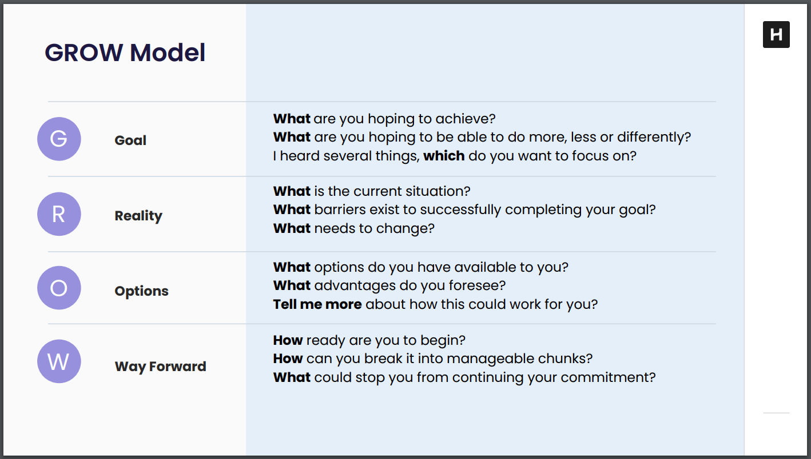

# Coach towards the goal

<https://honehq.sirv.com/class_materials/classes/coach_towards_a_goal/LearnerGuide_CoachTowardsAGoal.pdf>

## Key Takeaways

* The GROW coaching model is broken into four steps: the Goal, the Reality, the Options, and the Way Forward. Use the GROW framework to focus coaching conversations. Dig deep into each step with the four probing questions: Open Questions, Story Questions, Hypothetical Questions, and Closed Questions.

* Coaching lives on a spectrum from Very directie to Very supportive. Where somebody falls on this list depends on their level of expertise in the area. Somebody may be an expert in one area needing a more supportive approach whereas junior in another were they may need very direct instructions.

| Tone               | Type              | Example                                     |
|--------------------|-------------------|---------------------------------------------|
| Very directive     | Instruction       | "Do X"                                      |
| Directive          | Advice            | "It would be a good idea to do / try X"     |
| Somewhat directive | Suggestion        | "Consider doing X"                          |
| Neutral            | Feedback          | "Here are my thoughts on X"                 |
| Somewhat supportive| Asking Questions  | "What do you think about X?"                |
| Supportive         | Paraphrasing      | "It sounds like you're saying X"            |
| Very supportive    | Approval          | "I agree with and support your plan to X"   |

| Question Type         | Example                                          |
|-----------------------|--------------------------------------------------|
| Open Questions        | "Tell me more about ..."                         |
|                       | "What else do you think about ...?"              |
| Story Questions       | "What led you to ...?"                           |
|                       | "How did you come to feel that?"                 |
| Hypothetical Questions| "What if that wasn't a blocker for you?"         |
|                       | "What could you do if you had more help?"        |
| Closed Questions      | "Do you prefer X or Y?"                          |
|                       | "It sounds like you're saying ... Is that right?"|

## Notes

* When giving feedback, know what the person needs and what constraints are present (e.g. urgent vs non-urgent)
* Clarity is crucial

* What is the coach approach
  * Active listening + acknowledge and validate + ask empowering questions
  * Use the GROW Coaching Model

* Grow Coaching model
  * Goal
    * What are you hoping to achieve?
    * What are you hoping to be able to do more, less, differently?
  * Reality
    * What is the current situtation?
    * What barriers exist to successfully completing your goals?
    * What needs to change?
  * Options
    * What options do you have available to you?
    * What advantages do you forsee?
    * Tell me more about how this could work for you?
  * Way forward
    * How ready are you to begin?
    * How can you break it into managable chunks?
    * What could stop you from continuing this commitment?

* Coaching Spectrum
  * Directive <-> Supportive
  * Phrasing says where you are on this spectrum
  * Know where people are on this spectrum to know what style of coaching they need
    * Junior engineers - instructive
    * Senior engineers - asking questions
    * Principle engineers - approval
  * People need different types of support / coaching in different situtations. If they are trying somethign new, maybe be Very Directive while they learn. If they are doing something they are famliar with, maybe be more Supportive.

| Tone               | Type              | Example                                     |
|--------------------|-------------------|---------------------------------------------|
| Very directive     | Instruction       | "Do X"                                      |
| Directive          | Advice            | "It would be a good idea to do / try X"     |
| Somewhat directive | Suggestion        | "Consider doing X"                          |
| Neutral            | Feedback          | "Here are my thoughts on X"                 |
| Somewhat supportive| Asking Questions  | "What do you think about X?"                |
| Supportive         | Paraphrasing      | "It sounds like you're saying X"            |
| Very supportive    | Approval          | "I agree with and support your plan to X"   |

* Try to tap into preivous lived experiences the person has

* Benefits of more supportive apporaches (if appropriate)
  * More opportuniteis to try, which means
    * More opportunities to learn
    * More opportunities to grow
    * More opportunities to do differently / discover something better
  * Managers are not bottlenecks, people / teams are more independent and self-sufficient

* Asking intentional questions
  * Four probing questions
    * Open Questions - not yes or no answers, open ended
      * "Tell me more about ..."
      * "What else do you think about ..."
    * Story Questions - more powerful open ended questions
      * "What led you to ..."
      * "How did you come to feel that ..."
    * Hypothetical Questions - looking at options / possibilities
      * "What if that wasn't a blocker for you?"
      * "What could you do if you had more help?"
    * Closed Questions - narrowing down possibilities
      * "Do you prefer X or Y?"
      * "It sounds like you're saying ... Is that right?"
  * Use questions to better understand the Goal, Reality, Options, and Way Forward.

* Lead and coach by example.
