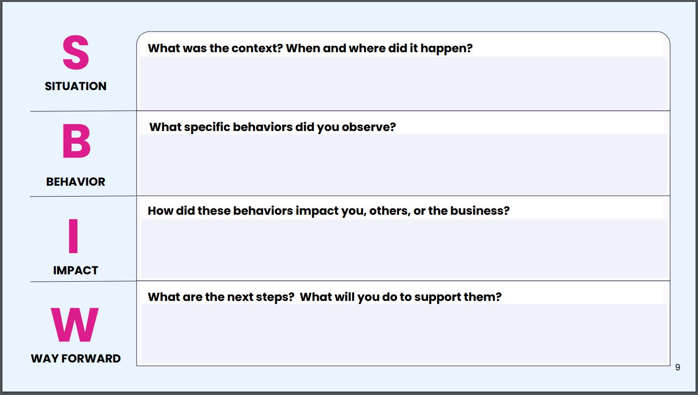

# Give feedback that lands

<https://honehq.sirv.com/class_materials/classes/give_feedback_that_lands/LearnerGuide_GiveFeedbackThatLands_v.F.3.24.pdf>

## Key Takeaways

* Feedback is critical to making teams effective and ensuring people grow in the ways they want and the organization needs.

* Give feedback based on factual and observable behaviors which may be changed, not emotional feelings.

* Use the Situtation Behavior Impact Way-Forward (SBIW) model to give feedback effectively and ideally unbiasly.

## Notes

* Feedback is a gift
* People who get feedback regularly
  * Are more productive
  * Less likely to leave their job
* 77% of employees want more feedback whereas 58% of managers think they give enough feedback
  * Quality and clarity of feedback is critical
  * Managers hvae limite time in capacity to invest in others
  * Managers may feel like the feedback they give is effective but in practice it is insufficient
* Reference: SBIW Feedback Model

* Why is feedback important?
  * Set expectations
  * Proactive approach to improving vs waiting until failure happens
  * Get a different perspective

* How can a feedback model help an organization?
  * Standardize feedback criteria
  * Avoid bias from personal relationships
  * Define process and make feedbacks feedback expected
  * Promotes a culture of feedback
  * Reduces confusion

* SBIW model:
  1. Situtation
  2. Behavior
  3. Impact
  4. Way Forward

* Situation + behavior
  * Identify the facts
  * Start with the facts, not emotions
  * "I noticed today that ..." not "I am not disappointed because ..."
  * Describe the situtation - when, where, and what happened?
  * Describe the observable behavior
  * Avoid generalizations like "never", "always"

* Impact
  * What impact did that have on the company, team, others, etc.?

* Way forward
  * Do a quick check-in
    * "What are your thoughts?"
    * "How does this feedback land?"
    * What did I miss?"
  * Identify next steps
    * "What are your next steps?"
    * "What kinds of support might be helpful?"
    * "How will you integrate this feedback into your work?"
  * Establish a follow up date to see how changes are working out

* Know how somebody prefers to recieve feedback to make feedback land more effectively
* Strive to make it a dialog instead of ajust a directive

* SBIW frameworks help with the mission of saying impartial
