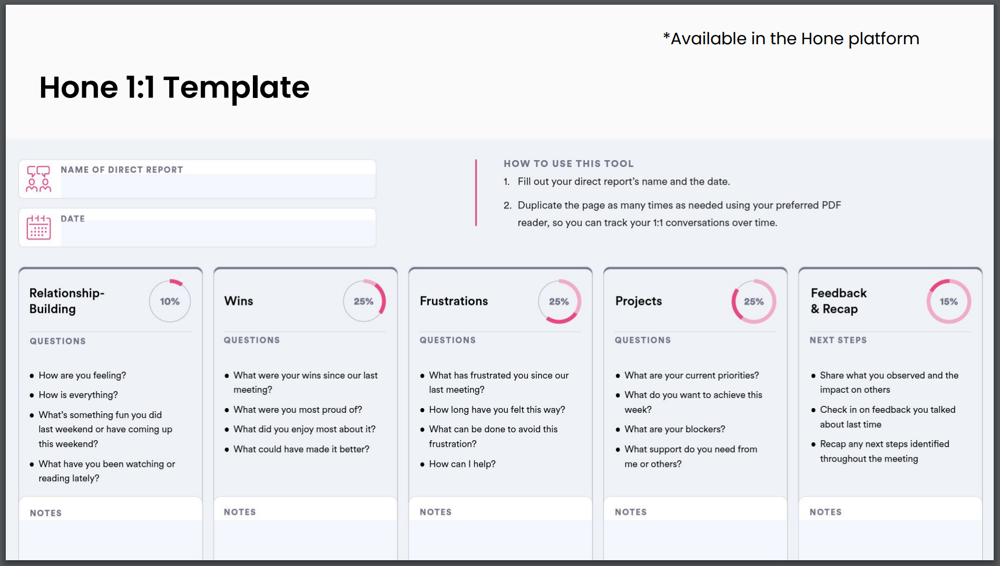

# Leading highly effective 1-1s

<https://honehq.sirv.com/class_materials/classes/lead_highly_effective_1-1s/LearnerGuide_Lead%20Highly%20Effective%201_1s_vF.2.24.pdf>

## Key Takeaways

* 1-1s are about building effective working relationships by building trust with direct-reports. To do this, use the following breakdown:
  * 10% relationship building
  * 25% wins
  * 25% frustrations
  * 25% projects
  * 15% feedback and recap
In each section, ask follow up questions and takes notes to look for trends and more importantly dig deeper into what the person values and how they like to work.

* Psychological safety is critical to high performing teams. If people do not feel psychologicaly safe they will not contribute as effectively as they could. So, 1-1s are a time to build that safe space to building highly effective teams.

## Notes

* Why is it important to have 1-1s consistently?
  * Build rapport
  * Creates opportunities to build trust and effective working relationships
  * Break the pace of the normal business pace to focus on career development
  * Opportunity to bring up things in a more private manner

* Traits of high performing teams from Google's Project Aristotle
  * Dependability
  * Structure and clarity
  * Meaning of work
  * Impact of work
  * Psychological Safety -- the most important factor
    * Feeling safe to fail
    * Feeling safe to try something different
    * Feeling safe to share ideas

* Employee <> Manager relationships are the first most factor for Job Satisfaction.
  * If people don't like their boss, they probably will not like their job.

* How to prepair for great 1-1s
  * Pause notifications
    * Be present completely
    * When the verbal and non-verbal mis-match, people assume the non-verbal is how the person really feels
  * Be distraction free
  * Take notes
    * Be able to stay on track, look for longer term patterns
    * Easier to keep a pulse on how things are progressing
  * Prepare metrics ahead of time

* Formula for great 1-1s
  * Structure:
    * 10% relationship building
    * 25% wins
    * 25% frustrations
    * 25% projects
    * 15% feedback and recap
  * Target at least 30 minutes at a minimum
  * Better to start with wins to open up the conversations and feel comfortable versus jumping striaght into frustractions which may make people become defensive / closed off.
* To experiment or introduce this new structure to 1-1s, let the person know you are going to try this new framework you learned about so it isn't weird.

* Relationships building
  * This is not just arbitrary chit-chat about the weather, find ways to connect with the individual and how they are feeling, their life, their dog, their cat, etc.
  * Find what the person is passionate about in life outside of work
* Wins
  * Achievements, accomplishments at work
  * "What did you enjoy the most about that win?" - open up a lot more about the "why" behind the win to start getting into values / principles
  * Ask follow up questions like:
    * Whare you most proud of?
    * What makes that a win for you?
    * What did you enjoy most about it?
    * What could have mide it even better?
* Frustrations
  * Don't want people to bottle it up and explode later
  * "What was the most frustrating part about that for you?" - get into the why / values / underlying principles.
  * "What ideas do you have do you think we can try to fix this frustration?" - try to turn the conversation into brainstorming solutions
  * Ask follow up questions like:
    * What is the most frustrating part?
    * What can be / could have been done to minimize this frustration?
    * How long have you felt this way?
    * How can I support you? Sometimes folks just need to vent, others it is to fix a problem / something in the environment
* Projects
  * What are you rucrrent priorities?
  * What do you want to achieve this week / before our next meeting?
  * What blockers do you have?
  * What support do you need from me or others?
  * Is there anything else it would be helpful to talk about today?
* Feedback and recap
  * Give feedback (positive, critical, both) in a clear and concise way
  * Follow up on feedback from previous discussions
  * Ask for feedback: What can I do better as your manager?
  * Recap any next steps / actions identified in the meeting

* Make adjustements depending on who you are talking to
  * New person to company, focus on relationship buildling for example
* Variations
  * Switch up the setting (e.g. virtual, in person, coffee, lunch)
  * Career conversations vs coaching
  * Whatever you do for one, do for all to avoid feelings of exclusion
* Prioritize 1-1s, canceling breaks trust
* Have a centralized and private document which both people can add things to and manage over time
* Send out survey asking what you can do to make 1-1s better to direct-reports.
* 1-1s should be focused on the person and building relationships whereas between 1-1s can focus more on doing the work / status updates
* Create the space to build these relationships by inviting people in, this is akin to an open door policy in a physical office but in a remote environment.
