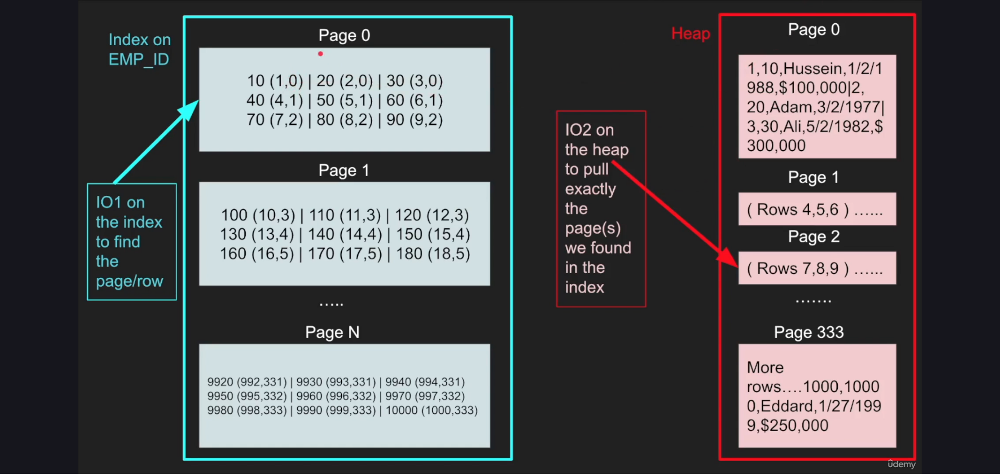

# Fundamentals of Database Engineering

<https://www.udemy.com/share/102qug3@spbpIDBtnkHSllaA3d02_yuzF_7eUzIOYnBArEv1EHqg14hLpySQdJMEz9by2NYc/>

## Key Takeaways

* TODO

## Notes

* A heap is compose of 8kb sized pages in Postgres; each page contains a finite number of rows and a row is what it sounds like containing all the column values for that row. Hitting the heap is expensive because it is often done by doing a Sequential Scan (aka. Seq Scan) because without an index Postgres must search through each page to ensure it has all the results which march your query. To make this lookup faster, Postgres supports indexes which create a lookup like `id (row number, page number)`. For example, a value like `1234 (2, 3)` means that record with `id = 1234` can be found at row `2` of page `3` in the heap. This makes lookups much faster. But, to reduce IO (in/out) is where Covering Indexes to support Index Only Scans come into play.

    

* Postgres aggresively caches things, so use `EXPLAIN (ANALYZE, BUFFERS) ...` to see cache hits; also frequently change the query itself to try and avoid those cache hits when evaluating performance of indexes.
