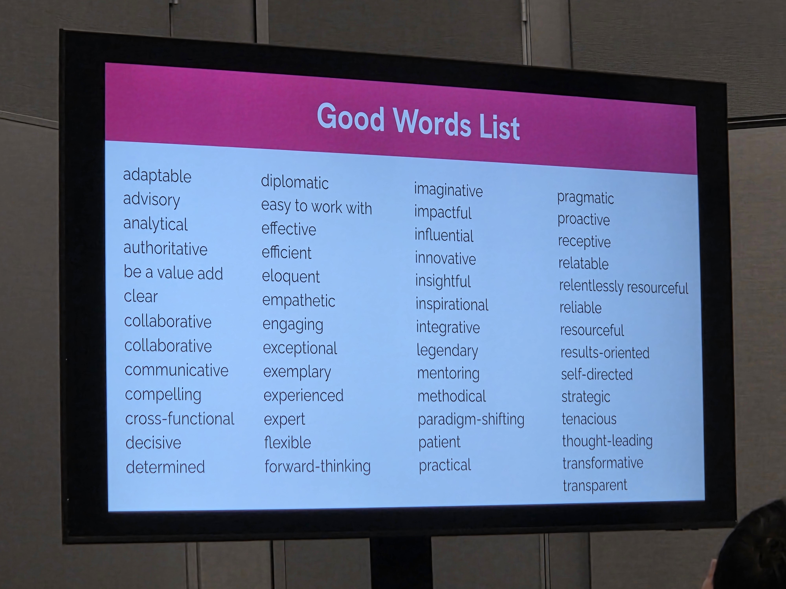

# Making your staff+ impact visible (LeadDev 2025)

Author: Krys Flores

## Key Takeaways

* As a Staff+ Enigneer, being visible is a requirement of the job. It means building strong working relationships with folks and using expert knowledge and political capital to influence organizational change.
  * REFERENCE: <https://blog.jgefroh.com/p/how-to-drive-meaningful-change-improve>
* To become a Staff+ Engineer, you must become visible in the right ways. Build a idealistic 5 word buisness card from the list below and then find mentors to (1) tell you if this aligns with the needs of the organization and (2) help level up in deficient areas.

### Notes

* I think I am percived as (give 5) ...

| Phrases / adjectives | Who thinks this? | Notes |
| --- | --- | --- |
| | | |
| | | |
| | | |
| | | |
| | | |

* I want to be percieved as (pick 5) ...

| Phrases / adjectives | Who thinks this? | Notes |
| --- | --- | --- |
| | | |
| | | |
| | | |
| | | |
| | | |

* These 5 words are your "5 word buisness card" - it is how you would describe yourself to new people you are networking with.

* Eagerly praise peers to build informal relationships outside of directly doing the work. This build a foundation for future working relationships.
  * Project completion
  * Work anniversaries
  * Good works (e.g. RFCs)
  * Notice helping others (e.g. onboarding buddy)
  * Welcoming committee (e.g. saying hello to new hires)

* Seek to be a mentor to help level up your own leadership skills.
  * Seek somebody who is eager to learn from you.
  * Include:
    * Who you're reaching out to
    * Why you think you'd be a good mentor for them
    * What you can teach them or help them develop
    * An invitation to connect and explore mentorship
  * This person does not have to directly report to you within the org structure

* Reflections during PRs
  * What specific area(s) need to be improved? Be as concrete as possible (e.g. code quality, architecture, tests)
  * How did you communicate this feedback? Think about tone and language.
  * Did you highlight anytyhing that was well done? What was it and how did you phrase that praise?
  * Write your answers as if you were coaching your future self to be both clear and constructive in feedback - balancing improvement suggestions and positive recognition.

* Seek a mentor to help you level up in areas you want to grow in
  * Seek somebody is eager to help you learn
  * Include:
    * Who you're reaching out to
    * Why you think you'd be a good mentee for them
    * What you hope to learn  or develop under them
    * An invitation to connect and explore mentorship

#### Minto Pyramid reminders for stakeholder weekly summaries

1. Start with the bottom line (conclusion)
    * What is the key message or main status update you want stakeholders to know right now?
    * For example, 'The project is on track to meet the deadline because we have completed critical milestones ahead of schedule.'
2. Provide supporting key points
    * What are the 2-4 most important points that explain *why* the bottom line is true?
    * For example, 'Completed backend API integration, resolved major security vulnerabilities, user acceptance tests show 95% pass rate'
3. Add detailed supporting information
    * What specific evidence, data, or results support these key points? Include metrics, dates, or relevant context.
    * For example, 'API integreated by Sept 15, vulnerability fixes reduced CVEs from 8 to 2. UAT performed on Sept 20 by QA team with documented results.'

#### BLUF Reminders for stakeholder weekly summaries

1. Bottom line up front
    * What is the single most important update or outcome this week? State is clearly in 1-2 sentences at the very beginning.
    * For example, 'Project X is on track for delivery next week, after successfully resolving the API integration issues.'
2. Key supporting details
    * What are the main points that explore or support your bottom line? Limit yourself to 2-3 concise bullet points.
3. Action requests or needs
    * Do you need your manager's input or support on anything? State this clearly in a final short sentence of bullet.
    * Example, 'Would appriciate your help in prioritizing the deployment resources next week.'
4. Keep it short and clear
    * Avoid jargon or unnecesary details. Focus on what your manager needs to know to support you and keep projects moving.

-----------------------------------

* Help define rubrics / get invovled in the hiring process - easy way to build social capital.
